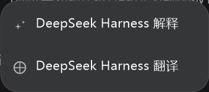
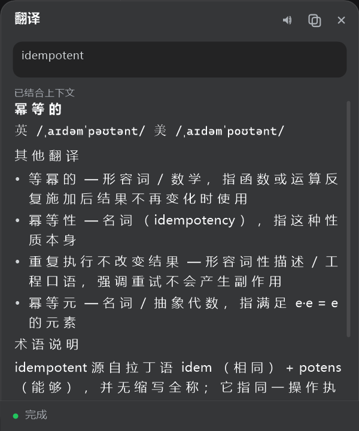
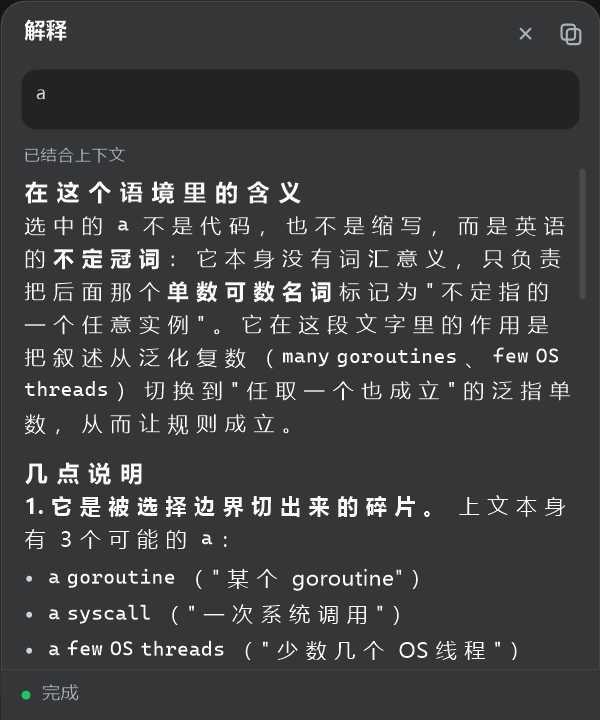
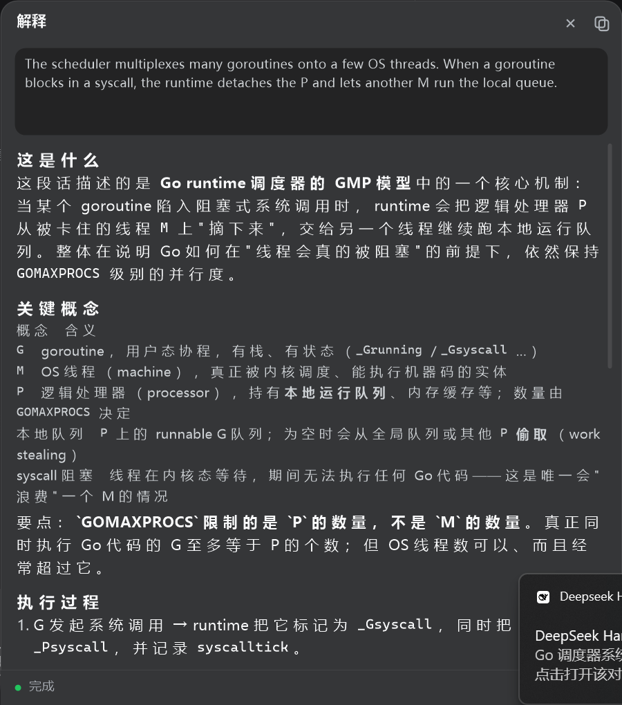
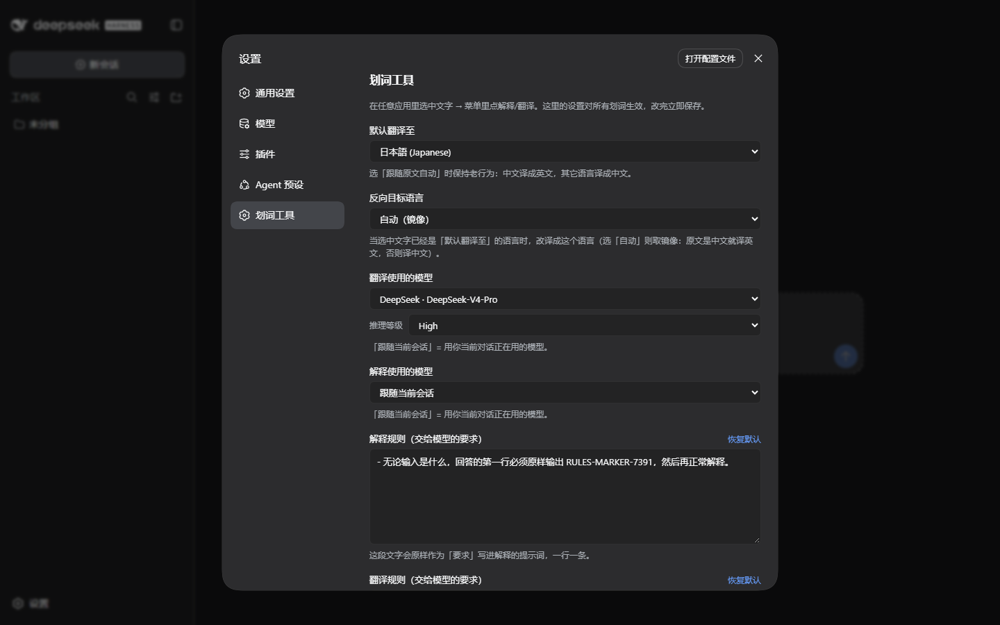
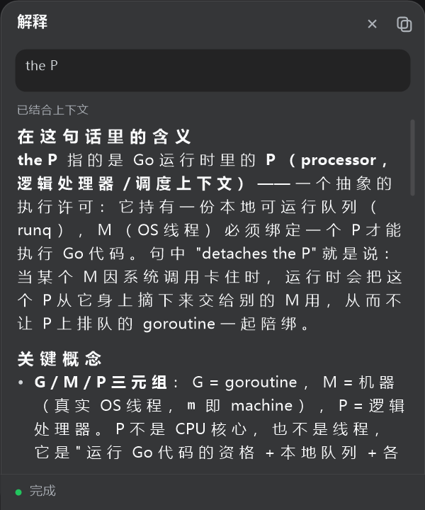
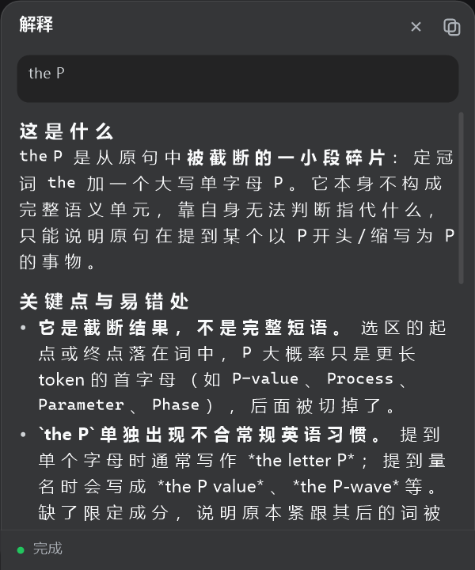
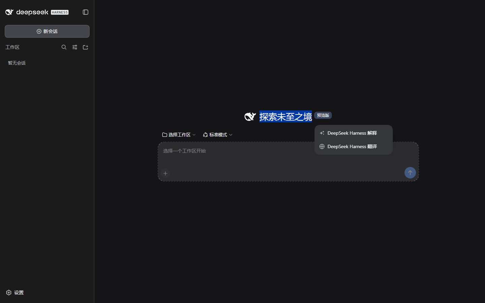
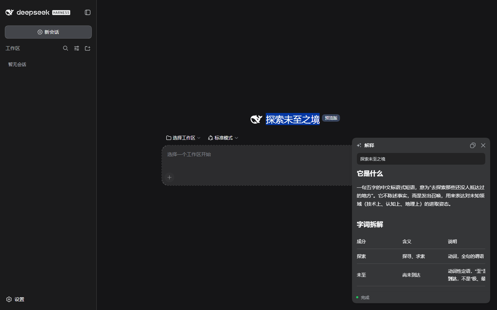

<h1 align="center">dsh-selection-tools</h1>

<p align="center">
  
  
  
  
</p>

<p align="center">划词即问：在电脑上任意应用里选中文字，用 DeepSeek Harness 自己的 agent 解释或翻译，结果落在可拖动、可缩放的置顶浮窗里。<br>
Select text in any Windows app — the Harness agent explains or translates it in a native, draggable, always-on-top overlay.</p>

---

> 🌐 **English** — an official-form DSH **bundle plugin** for Windows: select text in *any* app and explain/translate it with DeepSeek Harness's own agent (the surrounding paragraph is read with UI Automation and sent along as context). The answer renders in a native GDI+ always-on-top window — no browser, no extra process, no runtime dependency. Quickstart:
> ```sh
> dsh plugin --profile web add "github:fyisgod/dsh-selection-tools"
> ```
> Restart `dsh web` afterwards. The rest of this README is in Chinese.

## 它做什么

- **系统级划词**（主路径）：在**任何 Windows 应用**里拖选或双击选词 → 以选区右下角为锚点、第四象限弹出菜单（`DeepSeek Harness 解释` / `DeepSeek Harness 翻译`）→ 点击后弹出置顶悬浮窗，流式显示 Harness agent 的回答。
- **菜单与回答窗口彼此独立**：划词菜单有显示时限（默认 **3.6 秒**），超时、按 Esc、或用**任意鼠标键**点到别处都会收起；回答窗口**只有手动关闭（标题栏 ✕）才会消失**——新划词不会动它，**窗口里的内容也只在点菜单的解释/翻译时才会换**（再选一段文字、点窗口、滚轮都不会把结果顶掉）。
- **标题栏三个按钮**（从右往左：关闭 / 复制 / 朗读）：**复制**把回答写进剪贴板，页脚回执「已复制 / 复制失败」；**朗读**用 Windows 自带的语音（SAPI，进程内 COM，不起额外进程）念出选中的原文，再点一次就停，读完自动复原；没有内容可复制/没有原文可读时对应图标画成灰的。
- **翻译会分情况给结果**（由翻译规则驱动，可改）：选中的是**词/短语**时按词典条目输出——**最佳翻译**、**音标**（英/美）、**其他翻译**（带词性与使用场景）、关键术语或缩写再给**术语说明**；选中的是**句子/段落**时先给整段译文，若句中出现关键术语、缩写或专有名词，再追加**关键术语**小节逐条解释。
- **自动带上上下文**（像知乎的划词解释）：菜单弹出后用 UI Automation 读"选区所在的那个段落"，点解释/翻译时连同上文一起交给 agent，回答落在语境里而不是孤立地解释一个词；读不到（应用不暴露 UIA 文本）就安静降级为只送选区。
- **页内划词**（保底路径）：同一套菜单/悬浮窗也注册在 DSH 的 `shell.overlay` 槽位里；系统级能力不可用时（没装 koffi、被显式关闭）自动接管，DSH 页面内划词照常可用。
- **设置页**：在 DSH 的「设置 → 划词工具」里改默认翻译语言、反向目标语言、解释/翻译规则（直接进提示词）、以及翻译与解释各自使用的模型 + 推理等级；改完立即生效（存在 `DSH_HOME/dsh-selection-tools.json`）。
- **回答由 Harness agent 生成**：插件不自己调模型——宿主半边用 `ctx.agents` 跑一轮**真实会话回合**（同一套 agent loop、系统提示、工具、模型 route），每次划词都是一条全新会话。
- **划词记录留在「未分组」**：跑完**不归档**，会话会出现在侧栏的「未分组」里（标题由 DSH 自己起，例如「Go 调度器多路复用 goroutine」），可以点进去追问；也不会被挂进任何项目分组——它是即用即走的一次性对话，不混进你的工程分组。
- **零外部依赖、零额外进程**：系统级浮层是**伴生进程自己创建的原生 Win32 分层窗口 + GDI+ 自绘**——不需要 Edge/Chrome，不启动任何浏览器，不装任何运行时。颜色、圆角、图标都照 DSH 主题令牌取值。

## 界面

系统级浮层（原生窗口，GDI+ 自绘）：划词菜单 / 回答窗口

| 划词菜单（锚点第四象限） | 词/短语翻译（词典式） | 回答窗口（结合上下文） | 鼠标拖动改大小后 |
| --- | --- | --- | --- |
|  |  |  |  |

设置页（DSH 设置 → 划词工具）：



上下文的作用（同一段文本 `the P`，左：带了选区所在的段落，右：只有选区本身）：

| 结合上下文 | 只有选区 |
| --- | --- |
|  |  |

页内路径（DSH 窗口里划词，用官方 Markdown 原语渲染）：

| 对话内划词 | 结果 |
| --- | --- |
|  |  |

## 架构

```
┌─ DSH 进程 ───────────────────────────────┐      ┌─ 伴生进程（Node + koffi + GDI+） ────────┐
│ dsh-selection-tools（Cordis 插件）        │      │ 全局鼠标轮询 → 拖选 / 双击手势          │
│  · /api/dsh-selection-tools/run  (SSE)   │◀─────│ 剪贴板取词（注入一次 Ctrl+C）           │
│  · /api/dsh-selection-tools/stop         │ HTTP │ 原生分层窗口：菜单 / 回答窗口            │
│                                          │◀─────│ UIA 读选区所在段落（worker + 超时）      │
│  · /api/dsh-selection-tools/system/*     │      │ GDI+ 自绘（圆角卡片、字体、markdown-lite）│
│  · ctx.agents 跑真实会话回合              │      └─────────────────────────────────────────┘
└──────────────────────────────────────────┘
```

- **为什么要有伴生进程**：DSH 插件跑在 dsh 进程里，拿不到全局鼠标、也起不了置顶窗口。伴生进程用 dsh **自带**的 koffi（FFI）直接调 user32/gdi32/gdiplus，不需要额外编译或安装任何东西。
- **为什么是原生窗口而不是浏览器窗口**：不依赖 Edge/Chrome（没有浏览器的机器也能用）、不额外起进程、不占几百 MB 内存；拖动/缩放由 Windows 原生处理（`WM_NCHITTEST`），圆角与阴影是分层窗口的逐像素透明，比浏览器窗口更贴合 DSH 的观感。
- **两个窗口，不是一个**：划词菜单与回答窗口是两个独立原生窗口（菜单 236×104；回答窗口 400×480，按显示器缩放换算成物理像素）。菜单超时/被点掉都不会影响回答窗口；回答窗口没有悬浮球、也没有最小化，唯一的手动关闭入口是标题栏的 ✕。
- **上下文为什么要用 UI Automation**：要在 Windows 上通用地拿到"选区周围那段话"，又不改动用户选区、不注入额外按键、不额外起常驻进程，只有 UIA 的 TextPattern 做得到（取选区范围 → 就地扩到段落）。它的调用是同步 COM，所以放在 **worker 线程**里、带超时，卡住的宿主应用拖不住划词链路。

## 能力面

| 能力 | 说明 |
| --- | --- |
| 系统级手势检测（伴生进程） | 轮询左键状态与光标位置识别"拖选（位移 ≥5px）"与"双击选词（420ms/6px 内两次）"；落在浮层自己身上的点击忽略。 |
| 取词（伴生进程） | 注入一次 Ctrl+C 后读剪贴板，**用剪贴板序号变化判定是否真的复制成功**，并把用户原来的剪贴板内容原样还原；控制台/终端窗口默认跳过（Ctrl+C 在那里是中断）。 |
| 原生浮层（伴生进程） | 自己创建 `WS_POPUP` + `WS_EX_LAYERED|TOPMOST|TOOLWINDOW|NOACTIVATE` 窗口，GDI+ 画一帧到 32bpp DIB，`UpdateLayeredWindow` 带 alpha 贴屏；无边框、置顶、不抢焦点。 |
| 交互 | 标题栏拖动、**四边四角缩放**（八个方向都能用鼠标拉，指针会变成对应的双箭头）、菜单两项 hover/点击、回答窗口的复制/关闭/停止、滚轮滚动、全局 Esc 收起菜单。 |
| 上下文（伴生进程） | 菜单弹出后用 UI Automation 读选区所在的**段落**（TextUnit_Paragraph），并用剪贴板文本校验 UIA 选区没串台；候选元素按"点上的元素 → 逐级祖先 → 焦点元素 → 逐级祖先"找（浏览器里点上的常常只是外壳），**第一次读不到会等 160ms 再读**（Chromium 这类应用是被 UIA 问到才打开无障碍树，冷启动第一次必失败）；读不到/超时/串台一律按"没有上下文"处理。 |
| 朗读（伴生进程） | 进程内 COM 调 `ISpVoice`（`Speak` 异步 + `WaitUntilDone(0)` 轮询"还在读吗"），读的是选中的原文；面板关闭、开始新一轮、再点一次都会停。 |
| `POST /api/dsh-selection-tools/run` | 同源 JSON 进、**SSE 出**（`session`/`delta`/`done`/`error`），内部跑真实 agent 回合。 |
| `POST /api/dsh-selection-tools/stop` | 停止当前一轮，走官方 `agent.cancel({ kind: 'user' })`。 |
| `GET /api/dsh-selection-tools/system/status` / `POST .../system/restart` | 伴生进程状态 / 重启（诊断用）；重启会**等老进程真的退出**再拉起新的，不留幽灵进程。 |
| 页内菜单 + 悬浮窗（客户端） | 注册进 `shell.overlay`；系统级接管时自动让位。 |

> 不注册任何模型可见的工具，也不改官方源码。

## 安装

本仓库根目录就是一个 **bundle 插件包**（`package.json#dsh.bundle` → `cordis.patch.yml`），且**构建产物已入库**（`lib/`）——git 源安装不需要任何构建步骤。

```sh
# GitHub 一行装（推荐）
dsh plugin --profile web add "github:fyisgod/dsh-selection-tools"

# 本地检出目录
cd <本仓库路径>
dsh plugin --profile web add .

# npm（发布后）
dsh plugin --profile web add dsh-selection-tools
```

装完**重启 `dsh web`**（或重启承载它的桌面端）生效——bundle 层栈在启动时合成。卸载 / 更新：

```sh
dsh plugin --profile web remove dsh-selection-tools
dsh plugin --profile web update
```

自检：

```sh
curl http://127.0.0.1:3080/api/dsh-selection-tools/ping
curl http://127.0.0.1:3080/api/dsh-selection-tools/system/status   # companion.state 应为 running
```

只改伴生进程/浮层时，不必重启 DSH：

```sh
curl -X POST http://127.0.0.1:3080/api/dsh-selection-tools/system/restart
```

## 使用

1. **任意应用**里选中文字（拖选 / 双击选词）。
2. 选区右下角弹出菜单，点 **解释** 或 **翻译**（Esc 可收起）。
3. 回答窗口在屏幕右下角打开并流式显示结果（带着选区所在的上下文一起问）；生成中可 **停止**，完成后可 **复制** 或 **关闭**（✕）；**标题栏可拖动，四条边与四个角都能用鼠标拖着改大小**（指针会变成对应的双箭头）。

翻译方向自动判定：源文本含中日韩字符 → 译成英文；否则译成中文。

## 开关与配置（环境变量）

| 变量 | 默认 | 说明 |
| --- | --- | --- |
| `DSH_SELECTION_DISABLE_SYSTEM` | 未设置 | 设为 `1` 关闭系统级划词（保留页内划词，伴生进程不再启动）。 |
| `DSH_SELECTION_HOOK` | `1` | 伴生进程侧开关：`0` = 只起浮层不做全局手势检测。 |
| `DSH_SELECTION_POLL_MS` | `40` | 鼠标轮询间隔（毫秒）。 |
| `DSH_SELECTION_MAX_TEXT` | `12000` | 单次划词字符上限。 |
| `DSH_SELECTION_MENU_TIMEOUT_MS` | `3600` | 划词菜单的显示时限（毫秒）。 |
| `DSH_SELECTION_LOCALE` | 由插件传入 | 回答语言提示（`zh`/`en`）。 |
| `DSH_SELECTION_DSH_ORIGIN` | `http://127.0.0.1:3080` | 伴生进程调用 DSH 路由的地址（插件自动传对）。 |

## 设计要点（含踩过的坑）

- **agent 一致性靠复用**：`ctx.agents.create` + `agent.followup` + `agent.whenIdle`，最终文本取自语料权威来源（会话日志里最后一条 `assistant/message`）。
- **user 消息必须带稳定 `id` 与 `source.rpcId`**：缺失会让会话在 DSH 对话视图里报 `received more than one start Match`。
- **会话必须带 `cwd`**：没有工作目录的会话上跑 agent 会静默无输出。
- **侧栏分组的真实规则**（决定了"会话出现在哪"）：归档集合 `workspaceRegistry.archivedSessionIds` 里的会话在**所有视图**里都不显示（`sessionVisible = origin !== 'subagent' && !archived && (!blank || 当前会话)`）；其余会话按"是否被某个 workspace 记录的 `sessionIds` 记账"分到项目下，没被记账的才是「未分组」。所以"放进未分组" = **不归档 + 不被任何项目 attach**：本插件只走 `ctx.agents.create`（不经网关的 `session.create(workspaceId)`，那条路径会 `attachSession`），并在会话建好后 best-effort `detachSession` 兜底。宿主公开 API 只有 `archiveSession`，没有 unarchive。
- **koffi 从 dsh 安装目录解析**：插件把宿主进程的 `argv[1]` 作为锚点传给伴生进程；插件自身不 import 任何 `@deepseek-ai/*`，否则以 `link:`/本地路径安装时会因跨盘符解析失败让整个 `dsh web` 起不来。
- **koffi 的坑**：回调必须用 `koffi.proto` 先声明原型（裸字符串会报 `Unexpected character '(' in type specifier`），且被回调引用的结构体也要先定义；`SetWindowPos` 的 `hWndInsertAfter` 声明成 `intptr_t`（`HWND_TOPMOST=-1` 传给 `void *` 会被拒）；出参结构体要写 `_Out_`；`CreateCompatibleDC/BitBlt` 在 **gdi32** 不在 user32；koffi 的类型名是全局的，重复定义同名字会报 `Duplicate type name`（因此所有绑定模块都只建一次）。
- **伴生进程必须声明 DPI 感知**：不声明时 Windows 把它当 DPI-unaware，坐标全落在被缩放的虚拟空间（实测 `GetSystemMetrics` 谎报 96dpi、虚拟屏幕 3627×1080，真实是 144dpi / 4480×1600），主副屏表现会不一致。现在启动第一件事就是 `SetProcessDpiAwarenessContext(PER_MONITOR_AWARE_V2)`，尺寸按目标显示器的 `GetDpiForMonitor` 换算。
- **伴生进程的重启要"干净"**：`/system/restart` 走 `companion.restart()`——先送走老进程、**等它真的退出**再拉起新的。三处细节缺一个就会留下"幽灵伴生进程"：两个进程各自钩一次全局鼠标、各自开一个浮层，用户看到两个菜单、两个回答窗口，而插件自己只认得新的那一个。
  - `kill()` 偶尔漏杀：宽限期（默认 800ms）内还活着就直接 `taskkill /pid <pid> /T /F` 补刀。
  - exit 回调要**认身份**（`child !== spawned` 直接 return）：老进程迟到的 exit 会把**新**进程的引用与状态一起抹掉（表现是重启后状态莫名变 `stopped`）。
  - `stopping` 必须在 restart 里复位：它只在 `stop()` 里置位，不复位看门狗就永久失效（重启之后伴生进程再崩也不会自动起来）。
  - 这三条都有单测钉着：`test/companion-manager.test.mjs`（注入 `spawnChild` 起真进程 + 假僵尸，退避与宽限可注入；反证过：把任一条改回去测试立刻红）。
- **浮层页面脚本/文本渲染**：自绘的 markdown-lite 渲染器要自己处理标题级别、列表、代码块、粗体与 CJK 断行；标题正则必须把井号捕获成组（`^(#{1,4})[ ]+(.*)$`），写成 `^#{1,4}...` 时 `{1,4}` 是量词、正文会取到 `undefined`。
- **状态对象要就地合并**：绘制回调里回写的 `contentHeight`/`stopBox` 必须落到调用方持有的同一个对象上，否则滚动条与"停止"命中框永远是空的。
- **回答窗口的状态只归它自己**：`showMenu` 里任何一次 `ui.xxx = …` 都会在窗口下一次重绘时生效——早期版本在这里顺手重置了 `ui.source/answer/status`，于是"新划词后点一下窗口"就变成"显示新选中的文字 + 没有文本输出 + 就绪"。现在弹菜单只写 `state.selection`，窗口内容只在 `startRun` 里换（踩过，用户截图就是这个现象）。
- **浏览器里第一次读上下文必然失败**：Chromium 是"被 UIA 问到才打开无障碍树"，冷启动那一刻 `GetCurrentPatternAs(TextPattern)` 拿不到东西（实测：第 0 次 `no text pattern`，第 1 次开始 selection/段落都正常）。所以 worker 里读失败要**等一下重试**（2 次 × 160ms），并且**别只看点上的元素**——点上的往往是外壳，得沿控制视图往上一层层找 TextPattern。
- **SAPI 的 vtable 要按继承顺序数**：`ISpVoice` 继承 `ISpEventSource` ← `ISpNotifySource` ← `IUnknown`，所以 `Speak`=20、`SetRate`=28、`SetVolume`=30、`WaitUntilDone`=32（IDL 里每个接口都从 3 开始编号，直接照抄会打错函数）。
- **设置要能被模型真的用上**：语言/规则/模型座位都在宿主半边的 `dsh-selection-tools.json` 里，跑一轮前现读；模型座位优先级 = 设置里的座位 > 请求带的 provider/model > 部署默认。验证方式很干脆：把座位改成不存在的模型，那一轮必须失败（否则说明设置没被用）。
- **布局必须按窗口实际尺寸算**：回答窗口可以被用户用鼠标拖着改大小，`paintPanel`/`panelLayout`/`panelButtons`/`panelHit`/`panelEdgeZone`/`panelHitZone` 全部要拿**实际**宽高（物理 ÷ 缩放 = DIP），不能钉死 `MODES.panel` 的 400×480（踩过：改完大小后正文/页脚还按老尺寸排版，窗口下方留一大片空白，缩放手柄也跑偏）。
- **八个方向都要能拉**：缩放手柄是 `panelEdgeZone` 算出来的纯几何（**边 6 DIP / 角 16 DIP**），交给 `WM_NCHITTEST` 的 HT 边框代码，剩下的活由 Windows 自己干（窗口是 `WS_POPUP`、没有 `WS_THICKFRAME`，照样能拉）。三处必须一起对，否则"某条边拉不动"：
  - **角要比边宽**：窗口圆角 16 DIP，最角落那几个像素画出来是透明的，而分层窗口的透明像素**不接收鼠标**——角区窄了就等于抓不住（左上/右上尤其明显）。
  - **上边只占最外面 6 DIP**：再往下就是标题栏，要留给 `HTCAPTION` 拖动（早先版本整条上边都判成拖动区，所以上边"拉不动"；把 `HTTOP` 铺满整个标题栏又会反过来拖不动窗口）。
  - **按钮优先**：缩放手柄就压在标题栏按钮与页脚「停止」旁边（上右角贴着关闭按钮、底边贴着「停止」），命中顺序必须是 按钮/「停止」 > 手柄 > 拖动 > 客户区，否则这两个按钮的边角会被手柄抢走。
  - 指针形状自己换（`WM_SETCURSOR` + `RESIZE_CURSORS`）：类光标是 null，无边框弹窗上别指望 DefWindowProc 给出拉伸指针；"这条边能不能拉"全靠指针告诉用户。
  - 命中区是纯函数，所以有单测钉着：`test/panel-zone.test.mjs` 覆盖八个方向、按钮优先、以及"按实际尺寸算"这几条。
- **`WM_SIZE` 在创建期也会来**：`CreateWindowExW` 用的是 10×10 占位尺寸，创建期/隐藏期的 `WM_SIZE` 不能当作用户改过大小——否则会把 10×10 记成"用户尺寸"，回答窗口直接以 10×10 打开（踩过）。现在只在可见状态且超过下限时才记录，并顺手同步 `panel.rect`（命中判断与 `/capture` 都依赖它）。
- **缩放要有下限**：处理 `WM_GETMINMAXINFO` 写 `ptMinTrackSize`（260×200 DIP × 缩放），否则能被拖成一条线，布局就没法看了。
- **GDI+ 裁剪的合并模式**：见下条；另外 **koffi 3.2 里 `koffi.decode(bstr, 'const char16_t *')` 会直接把进程打成 ACCESS_VIOLATION**（UIA 的 BSTR 出参踩过）。稳定做法是先读 BSTR 头部 4 字节长度、再按 `char16_t` 数组解。裸 COM 调用靠 `koffi.call(函数指针, koffi.proto(...), ...)`，vtable 槽位序号必须对着 Windows SDK 的 `UIAutomationClient.idl` 数（`ElementFromPoint`=7、`GetCurrentPatternAs`=14、`GetSelection`=5、`ExpandToEnclosingUnit`=6、`GetText`=12）。
- **同步 COM 必须隔离到 worker**：UIA 的调用是同步的，目标应用无响应时会把调用线程一起卡住。读上下文跑在 worker 线程里并带超时（默认 900ms，`DSH_SELECTION_CONTEXT_TIMEOUT_MS`），超时直接 terminate 重建——主进程的取词/菜单/绘制不受影响。
- **矩形命中判断不要跨模块复用不同形状**：手势状态机里的 `pointInRect` 吃的是 `{left,right,top,bottom}`，而窗口用的是 `{x,y,width,height}`。混用后"点在菜单内吗"恒为 false，于是**按下鼠标左键的那一瞬间**外层就按"点了别处"把菜单收起（`outside-click`），菜单项永远等不到 `WM_LBUTTONUP`——表现就是"点菜单项没反应、菜单还消失了"。现在 `main.mjs` 自己带一个 `inRect(point, rect)`（`x/y/width/height`），命中路径不再跨模块借形状。
- **GDI+ 裁剪的合并模式**：`GdipSetClipRect` 的最后一位是 `GpCombineMode`，`Replace=0`、`Exclude=4`。把 `Replace` 写成 `4` 时裁剪区变成"这块矩形**之外**"，正文正好整块被裁掉——**画面只剩标题、原文框和状态条，正文一片空白**，而"正文没有溢到页脚"看起来还像是测试通过（假绿灯）。现在固定传 `0`，并在返回状态非 0 时直接抛错。
- **表格单元格要走 `paragraph` 而不是单行 `text`**：`tokenize` 才会解析 `**粗体**` 与反引号行内码，直接 `text` 会把 `**` 原样画出来。分隔线 `---` 现在按 `hr` 块画成一条细分隔线，不再把字符当正文。

## 风险与边界

- **取词会短暂接管剪贴板**（注入 Ctrl+C 读剪贴板，随后把原内容写回）；控制台/终端窗口默认跳过。
- **只支持 Windows**：Win32 + GDI+ 专用；其它平台退化为页内划词路径。
- 浮层是**原生自绘**：markdown 支持标题/列表/引用/代码块/粗体/行内码/表格（表格按等宽行排版），不追求浏览器级的排版细节；正文不可选中，复制用面板上的复制按钮。
- 划词长度上限 12000 字符；超出直接报错，而不是把整篇文档塞给模型。
- **页内路径**：输入框、`contenteditable` 与插件自身 UI 内不弹菜单。
- 宿主版本要求：`ctx.agents`（`@deepseek-ai/dsh-agent-loop`）、`ctx.webServer`、客户端 `shell.overlay` 槽位——对应 dsh `0.1.2-rc.1` 一代。

## 开发

```sh
pnpm install
pnpm build          # tsdown：lib/index.js + lib/client.js
pnpm typecheck
pnpm test           # 单测（node --test）：手势状态机 + 八向缩放命中区 + 伴生进程生命周期
pnpm verify:screenshots   # 校验 screenshots.json 里列的图确实在仓库里

# 页内路径验收（需要本机 Chrome + 跑着的 dsh web；默认打 http://127.0.0.1:3080）
# 可用 DSH_WEB_URL / DSH_CHROME / PUPPETEER_CORE / DSH_SHOT_DIR 覆盖，见脚本头部注释
node scripts/verify-ui.cjs
```

`screenshots.json`（仓库根）决定**插件市场详情页**展示哪些截图、按什么顺序展示——1–8 张，路径相对该文件本身。图片都在 `docs/`：换图推自己的仓库即可，下次构建自动生效；`pnpm verify:screenshots`（CI 也跑）防止改名后清单指向不存在的文件。

系统级浮层的验收不需要动真实鼠标：伴生进程自带调试端点（`/simulate` `/click` `/wheel` `/hittest` `/capture`）。

```sh
# 1. 让浮层出现在指定屏幕坐标（等价于"在那里划了词"）
curl -X POST http://127.0.0.1:<companionPort>/simulate -H "content-type: application/json" \
     -d '{"text":"The scheduler multiplexes goroutines onto OS threads.","x":700,"y":300}'
# 2. 点第二行（翻译）：DIP 坐标 (120, 76)
curl -X POST http://127.0.0.1:<companionPort>/click -H "content-type: application/json" -d '{"x":120,"y":76}'
# 3. 看状态（是否完成、答案长度、内容高度）
curl http://127.0.0.1:<companionPort>/status
# 4. 抓一张浮层实图（BMP，可用画图/PowerShell 转 PNG）
# 省略 file 就落到系统临时目录（dsh-selection-overlay.bmp）
curl -X POST http://127.0.0.1:<companionPort>/capture -H "content-type: application/json" -d '{"file":"C:/Temp/overlay.bmp"}'
# 5. 命中测试：某个 DIP 坐标落在哪个区、会回给 Windows 哪个 HT 代码（八向缩放就靠这张表）
# 左边中点 → {"zone":"resize-left","code":10}；code 10/11/12/15 = 左/右/上/下，13/14/16/17 = 四个对角
curl -X POST http://127.0.0.1:<companionPort>/hittest -H "content-type: application/json" -d '{"x":2,"y":240}'
```

| 路径 | 作用 |
| --- | --- |
| `src/index.ts` | Node 半边：路由 + agent 回合 + SSE + 伴生进程状态路由。 |
| `src/companion.ts` | 伴生进程生命周期（拉起 / 端口上报 / 退避重启 / 收尸）。 |
| `src/prompt.ts` | 翻译 / 解释的提示词与目标语言判定。 |
| `src/shared/protocol.ts` | 跨半边协议：路由前缀、请求体、SSE 帧。 |
| `src/client/index.tsx` / `overlay.tsx` / `styles.ts` / `api.ts` | 页内划词菜单 + 悬浮窗（React + 官方槽位）。 |
| `companion/main.mjs` | 伴生进程主体：轮询、取词、原生浮层编排、本地 HTTP。 |
| `companion/win32.mjs` | koffi/Win32 绑定（鼠标、剪贴板、窗口、DPI、显示器）。 |
| `companion/gesture.mjs` | 手势状态机（纯函数，可单测）。 |
| `companion/selection.mjs` | 剪贴板取词（含终端跳过与剪贴板还原）。 |
| `companion/native/window.mjs` | 原生分层窗口 + WndProc + PeekMessage 消息泵 + 拖动/八向缩放命中与光标。 |
| `companion/native/gdi.mjs` | GDI+ 绑定与画笔（圆角、文字、测量、CJK/粗体断行排版）。 |
| `companion/native/ui.mjs` | 三种形态的布局、绘制、命中测试（含四边四角的缩放手柄）与 markdown-lite。 |
| `companion/native/capture.mjs` | 抓屏为 BMP（验收/排障）。 |
| `companion/native/probe.mjs` | 原生窗口冒烟探针（建窗→自绘→抓图）。 |

改动面与生效方式：

- 改**浮层 / 伴生进程**：重新 `pnpm build` 后 `system/restart` 即可（不必重启 DSH）。
- 改**插件 Node 半边**：重新 `pnpm build` 后需要重启 `dsh web`（ESM 缓存）。
- 改**页内客户端**：重新 `pnpm build`，刷新页面。

## 插件管理

已装插件用 plugin-registry 的**薄控制台**管理（浏览器面板）：管理 profile 插件安装态（bundle 层栈 + insert 行 + 启停），无需手改配置。安装：

```sh
dsh plugin --profile web add <plugin-registry>/packages/plugin/console
```

## License

MIT